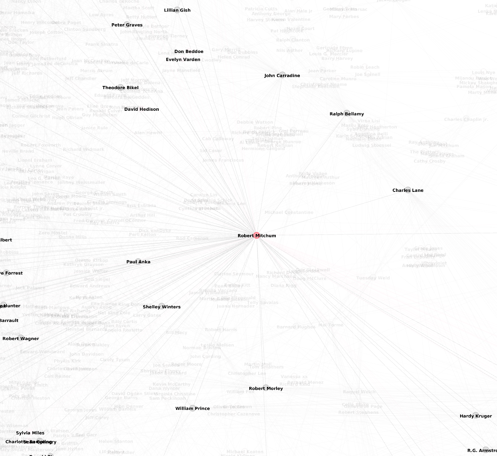
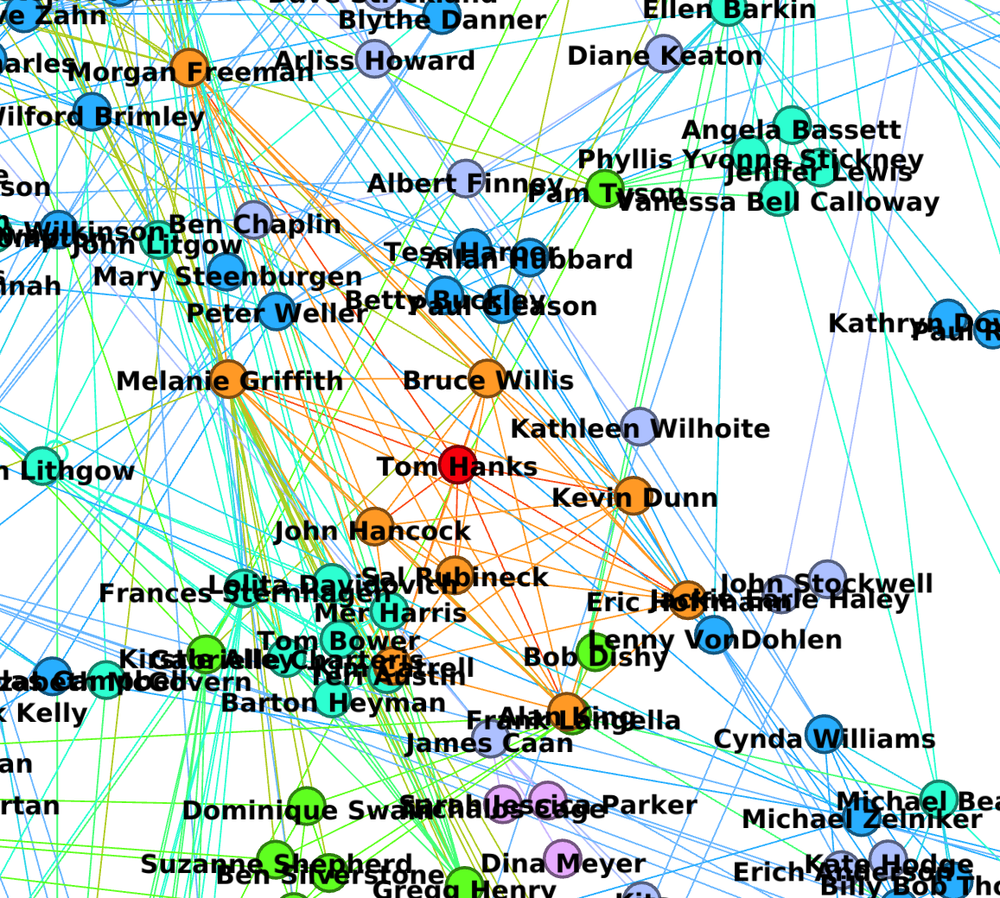

# HW3 Social Network Analysis

https://courses.fit.cvut.cz/NI-DDW/hw/03/index.html

___

Program načte ze souboru casts.csv prvních `INPUT_ROWS = 10000` záznamů, kvůli dlouhé době zpracování při vyšších číslech.

## Základní statistiky datasetu
```
=================Input==================
Loaded 9619 actors
========================================
=================Stats==================
Number of nodes:      5827
Number of edges:      29950
Density:              0.0017644579953247459
Number of conponents: 341
========================================
```

## Důležité osoby z hlediska centralit
```
==============Centralities==============
degree_centrality - Top 5: 
  Robert Mitchum (0.025231719876416068)
  Humphrey Bogart (0.021798832818400275)
  Alan Hale (0.017679368348781328)
  Claude Rains (0.017164435290078956)
  Clint Eastwood (0.016649502231376588)
closeness_centrality - Top 5: 
  Robert Mitchum (0.2781645190765088)
  John Carradine (0.2685279554604471)
  Claude Rains (0.26477547837049065)
  Richard Burton (0.26397281792909405)
  Robert deNiro (0.2625166497224294)
betweenness_centrality - Top 5: 
  Robert Mitchum (0.03045962331008836)
  Clint Eastwood (0.028947700618518576)
  Robert deNiro (0.02225406951066695)
  John Carradine (0.021256803605447565)
  Humphrey Bogart (0.01769026331114617)
========================================
```

## Důležité clustery

```
=======Top 5 biggest communities========
ID 3, 1938 actors:
Zsa Zsa Gabor, Lucile Watson, Cecil B. DeMille, Ruth Dwyer, Barbara ONeil, Mike Mazurki, Lally Bowers, Frank Darien, Lionel Jeffries, Laurence Oliver, Hans vonSchlettow, Gordon McRae, Gregg Palmer, Ralph Macchio, Edna Purviance, Mary Martin, Housely Stevenson, Hank Mann, Walter Hudd, Eddie Parker, Marjorie Rambeau, Warren Hymer, Gene Krupa, Bradford Tatum, Henry Wilcoxon, Delia Bocardo, Allan Jones, Jeff Corey, Julie Harris, Luke Askew, John Gilbert, Tom Moore, Seymour Hicks, Isabel Jeans, Kenneth Griffith, Keir Dullea, Scatman Crother, Arnold Moss, Jean Muir, Loren Tindall, Charles Waldron, Hermione Baddeley, Wendy Barrie, JeanRoger Milo, Arthur Byron, Eugene Pallette, Henry Walthall, Harold Vermilya, Paul Massie, Barton McLane, Mickey Shaughnessy, Andrew Keir, Eddie Bracken, Frank Lawton, Anna Sten, Ellen Busteyn, Donald Pickering, Charles Coburn, Richard Chamberlain, Melvin Stewart, Michael Hordern, Jane Bryan, Michael Rooker, Charles Hill Mailes, Margery Wilson, Tony Galento, Frank McHugh, Anne Revere, Maria Ouspenskaya, Percy Herbert, Adreinne Dore, Kay Walsh, O.B. Clarence, Sacha Guitry, Anita Louise, John Alexander, Leo Gordon, Joan Perry, Rhonda Fleming, Joe E. Brown, Louise Carter, Jeanne Crain, Jeanie McPherson, Jay C. Flippen, Spencer Tracy, Natalie Schafer, Nella Walker, Terry Kilburn, Barbara Whiting, Richard Haydn, Erc Bye, Marc McDermott, John Leyton, Bill William, John Shea, Clark Gable, William Haade, Patrick Cargill, Marjorie Gateson, Howard Hill, Jack Watson, Micket Shaughnessey, Walter Woolf King, Marion Davis, Frank Morgan, John Dierkes, Carole Lombard, John McGiver, Michael Wolf, Page Peters, Frank Craven, Ann Penningtin, Marco Rodriguez, Naoh Beery, Alastair Sim, Lionel Atwill, Dick Crockett, J.W. Johnston, John Cusack, Saeed Jaffrey, Jack Haley, Paul Whiteman, Charles Lloyd Pack, Laurence Harvey, Frank Puglia, Harold Huber, Peter Fonda, Richard Carle, Elissa Landi, Eric Porter, Sidney Lassick, Diana Lynn, Nicholas Cage, Porter Hall, Ronald Pickup, John Ringling North, Paulette Goddard, Margaret Fielding, John Roche, Charles Farrell, Conway Twitty, Claire Kelly, Vivien Leigh, Mai Britt, Alice Brady, Phyllis Brooks, Rob Scheider, Karen Morley, Geoffrey Lewis, William Doherty, Clarence Kolb, Edward Arnold, Jack Klugman, Howard Keele, Benton Churchill, Leif Erickson, Diana Lewis, Barbara Werle, June Lang, Skeets Galagher, Harris Yulin, Lumsden Hare, Marjorie Daw, Tyler Brooke, Alison Skipworth, Charles Dingle, Robert Barrat, Karl Dane, Ruth Nelson, The Platters, Bruce Bennett, Florence Vidor, Philippe deLacy, Robert Middleton, George F. Marion, Selena Reynolds, Doroty Tutin, Nora Swinburne, Howard MarionCrwaford, Betty Buckley, Walter Rilla, Scott Glenn, Tony Basil, John Garfield, Snitz Edwards, Melville Cooper, Charles Smith, Richard Arlen, Alice Faye, Marcelline Day, Larry Parks, Sydney Greenstreet, Frank Wilcox, Anthony caruso, William Haines, Douglas Wilmer, Dave Willock, Beverly Garland, Jeanette MacDonald, Cyril Cusack, Helen Westlet, Hayward Robillard, Peggy Evans, Ed Begley, Rossanno Brazzi, John Savage, Hank Worden, Noble Johnson, Herbert Anderson, Michael Lerner, Frank Finlay, Gregory Peck, Dick Powell, Elizabeth Patterson, Debra Paget, Billy deWolfe, James Dunn, Ruth Selwyn, Jill Balcon, Karin Schubert, Michael Ray, Percy Helton, Bill Goodwin, Charles Bronson, Linda Chistian, Ann Shoemaker, Joachim Hauser, Juano Hernandex, Horace Morgan, Alfie Wise, Paula Trueman, William Hudson, Ivor Barnard, Valerie Taylor, Ann Little, Kim Catrall, Frank McGlynn, Virginia Bruce, Oscar Levant, Katherine Alexander, Eric Hoffmann, Robert Warwick, John Calhoun, David Manners, Muriel Kikland, Elizabeth Allen, Loretta Young, Claude Jarman jr., Bruce Yarnell, Harold Kaskel, Arthur Houseman, Benny Rubin, Dorothy Dell, Esther Howard, Thomas Gomez, Estelle Parsons, Richard Egan, Grace MacDonald, Evelyn Ankers, Leonard Mudie, Paul Fix, David Janssen, Walter Winchell, LeslieAnn Doen, Irving Pichel, John Warburton, Sal Rubineck, Artur Rubinstein, Leslie Banks, Boris Karloff, The Andrews Sisters, Judy Nugent, Erville Anderson, Valerie Hobson, Frank Conroy, Jennifer Jones, Dennis King, Veree Teasdale, Bill Gordon, Louis Wolheim, Elsa Martinelli, Jean Porter, Angela Pleasance, Richard Erdmann, Claude Jarman jr, Steve Buscemi, James Congdon, Henry Rollins, Arnold Hess jr., Myron Healey, Alexander Knox, James Woods, Monroe Owsley, Wolfgang Preiss, Ina Claire, Billie Dove, Henry Jones, Gene Lockhart, Steve Brodie, William Bergen, Margery Rose, Fritz Korther, Diana Wynard, Russel Crowe, Lawrence Grant, Barbara Hale, Quentin Tarantion, Dinah Shore, Priscilla Presley, Chester Morris, Donald Moffatt, Peter deLuise, Gardner McKay, Tommy Dorsey, Paul Anka, Grady Sutton, Egon Brecher, William Farnum, Lionel Attwill, Vampira, Peggy King, Veronica Lake, Henry Brandon, Chalie Martin Smith, Ernest Torrence, Miles Mander, Donna Mitchell, Steven Berkoff, Tom, Henry Daniell, Wendell Cory, James Dean, Ruth Donelly, Reginald Denny, Adolfo Celi, Jack Riley, Cecil Kellaway, Agnes Ayres, Victor Kilian, Arthur Edmund Carewe, Nancy Carroll, Lilian Ghish, Wini Shaw, James Flavin, Blanche Yurka, Andrew Cruikshank, Edmund Gwenn, Massimo Serato, Robert Mandan, Fredric March, Gale Sondergaard, Florence Arliss, Patric Doonan, Vladimir Sokoloff, Hank Azaria, Clive Brook, Hannah Gordon, Eduard Franz, Dora Bryan, Gary Goodrow, Spring Byington, Stephen Boyd, Wilfrid Lucas, Jim backus, Mary Boland, Lowell Sherman, Irene Hervey, Billy Bevan, Theodore Roberts, Ann Miller, Kenny Baker, Norman Bristow, Charles Starrett, Maurice Chevalier, Joseph Cotten, Jack McGowran, Bud Abbott, Dick Wesson, Sally ONeil, Fred Clark, William H. Macy, Clara Bow, Margeret Wycherly, Leo G. Carrol, Patricia Morrison, Monroe Salisbury, Lucille Ball, Ricardo Montalban, Helen Flint, Harry Hayden, Sally Ann Howes, Patrick Dewaere, Ralph Michael, Ludmilla Tcherina, Nathalie Delon, Dick LaStrange, Genevieve Tobin, Gene Evans, William Hartnell, Joanna Lumley, Charles Drake, dArcy Corrigan, Stubby Kaye, Robert Hardy, William Katt, Paul Panzer, Carl Esmond, John Rourke, Suzanne Pleshette, Sting, Kristy Swenson, Henry Bergman, Julie Haydon, Jack Webb, Alonzo Price, Lee Montgomery, Kathlenn Harrison, Fred Vincy, Phil Donahue, Geoffrey Horne, Anthony Quinn, Helen Walker, Moroni Olsen, The Ritz Brothers, Telly Savales, Elizabeth Welch, Gail Patrick, Constance Moore, Lorna Thayer, Ron Moody, Jason Robards jr, Art Baker, Carol Dempster, Roland Young, Mercedes McCambridge, Anthony Baird, Eric Campbell, Teresa Graves, Paul Hoerbiger, Hillary Brooke, Lynne Carver, Joseph Crehan, Noah Beery jr., Natasha Parry, Luis Avalos, Elliott Dexter, Frances Langford, Andy Devine, Bessie Love, Emily Longstreet, Alfred Paget, Rhys Williams, David Brian, Jill Esmond, Joseph Sawyer, Frank mcGlynn sr, Gene Kelly, Douglas Kennedy, Gabrielle Brume, Gloria talbot, Jane Lapotaire, Margaret Lindsay, Barbara Hershey, Herbert Shaw, Ann Dvorak, Florence Rice, Paolo Stoppa, Henry Travers, Joey Heatherton, W.C. Fields, George Fawcett, Barbara Stanwyck, Porter Strong, Louise Fazenda, Walter Hampden, Alexander Scourby, Valentina Cortesa, Montgomery Clift, Beulah Bondi, Doris Hare, Edward Cianelli, Miles Anderson, Earl Wilson, Leo Glenn, Colin Blakely, Spike Jones, Kurt Kaznar, Ann Harding, John Davidson, Joan Benham, Kenneth Moore, Cecelia Loftus, Leo Genn, Michael Melling, Nigel Bruce, Estelle Winwood, Kevin Karson, Cyril Fletcher, Montagu Love, Gerald Ward, Roddy McDowall, Horace McMahon, Barbara Kent, Alan King, Raymond Walburn, Ray Wise, Stanley Brock, Esmé Percy, Derren Nesbitt, Katherine Blake, Freda Jackson, Betsy Drake, Marcel Dalio, Margaret Dumont, Thomas beck, Chico Marx, Jarma Lewis, Lydia Sherwood, Joe Dobisch, Art Malik, Wyndham Goldie, John Justin, Gar Moore, Carol Lindley, Tom Drake, Eve Arden, Priscilla Lane, Douglass Montgomery, Sylvia Miles, Peter Copley, Janet Blair, Gloria Stuart, The Ink Spots, Mae West, Cecil Rathbone, David Warren, Charles Winniger, Basil Rathbone, Joan McCracken, Marjorie White, John Garrick, James Gleson, Gustav vonSeyfferlitz, James Donald, Kay Francis, Denise Darcel, Steve Allen, Meg Ryan, Louis Jordon, Gemma Craven, Robert Ames, John Litel, Charles Judels, Oreste Kirkop, Robert Barat, Ronald Fraser, Clare Bloom, Peter vanEyck, Douglass Dumbrille, John Williams, Dick Davalos, Leora Dana, Charles McGraw, Tamara Shayne, Eric Portman, Craig Stevens, Ralph Morgan, Ish Kabibble, Flora Robson, Godfrey Teale, Lon Chaney jr, William Powell, Anthony Nicholls, El Brendel, Robert Benchley, Jean Peters, Martha ODriscoll, Holmes Hernert, Maxie Rosenbloom, Debbie Mcgowan, Byron Barr, Sidney Greenstreet, Audre Meadows, Harvey Lembeck, Richard Beymer, David Straithearn, Fernando Lamas, Lauren Bacall, Judy Bowker, George K. Arthur, Frederick Valk, Viva Tobin, Jeff Morrow, Allen Garfield, Doris lloyd, Frances Hunt, Joanna Barnes, Donald mcBride, Guy Marchand, Dorothy Vaughn, Charlotte Rampling, Jonathan Haze, Annabelle, Lon Chaney, Christopher Gable, Lee Tracy, John McMartin, Ewan Roberts, Robert Armstrong, Winter Hall, Warren Finnerty, Richard Davolos, Marie Dressler, Ralph Bewllamy, Jayne Meadows, Robert Walker, Hurd Hatfield, Joseph Tomelty, Melvyn Douglas, Helen Westley, David deLuise, Park Overall, Efrem Zimbalist jr, Leonid Kinskey, Nancy Kelly, Susan Hayward, Lauren Holly, Jane White, Richard Wattis, Donald Dillaway, Shemp Howard, Henry Stephenson, Topol, Chita Rivera, Roy Goldman, Dennis ODay, Elinor Glynn, Maureen OSullivan, Jane Darwell, Michele Morgan, Lois Nettleton, William Challee, Hershel Benardi, Dennis Haysbert, Ian Jenble, Mary Nash, David Lodge, Bernard Archard, Mitzi gaynor, Wendell Corey, Dub Taylor, Robert Strauss, Otto Preminger, Michael V. Gasso, Louise Lasser, Raymond Huntley, Ted Wass, Margaret Lockwood, Sally Ann Struthers, Agostina Belli, Ann Todd, Adelene deWalt Reynolds, Stan Musial, Seymour Cassel, John Hancock, LesleyAnne Down, Ralf Harolde, Edward Fielding, Theodore Bikel, David Hedison, Frances McDormand, M. Valli, Frank Jenks, Mady Christians, Rosemary deCamp, Tsi Chin, Albert Austin, Bruce cabot, Tom Douglas, Nils Asther, David Zucker, H.Richard Greene, Nacy Davis, Reginald Owen, Simon Oakland, Van Johnson, Peggy Ashcroft, Marthe Keller, Wanda Hawley, Vittorio deSics, Arthur Riscoe, Kim Catrell, Leif Garrett, Dean Stockwell, Robert Hutton, Dinah Sheridan, Christian Rub, Virginia Mayo, Jason Robards jr., E.E. Clive, Natalie Nogulich, John Carson, Celeste Holm, Henry Fonda, Oliver Hardy, John Welsh, Don Ameche, Andrew Prine, Gilbert Roland, Elzbieta Czyzewska, Ann Sheridan, Charles King, Tiny Sandford, Paul Lambert, Joanne Woodward, Murray Leonard, Rita Hayworth, Weird Al Yankovic, Elaine Stritch, William 'Stage' Boyd, Mel Welles, Patric Knowles, Dolores Costello, Anna Thomson, Tom Dugan, Erskine Sandford, Alexander Granach, Mary Gordon, Dolly Parton, Marsha Mason, Claire Bloom, O.J. Simpson, Pasquale Amato, Capucine, Kurt Katch, Robert Greig, Marlena McGuire, none, Vince Barnett, David Lewis, Helen Kane, Curt Bois, Celia Johnson, Troy Donahue, Orson Welles, Beatrice Pearson, Jack Luden, Lillian Yarbo, Jay Silverheels, Timothy West, Sarah Pickering, Mary Lou Retton, Helen Chester, Emma Dunn, Deanna Durbin, Joan Crawford, Robert Coote, Jimmy hanley, Burt Kwouk, Jack Benny, Stanley Baker, Miriam Cooper, Sean Connery, Kenneth Colley, Warner Anderson, Kathy Baker, Joseph Keaton, Miriam Hopkins, Jason Roberts, F.J. McCormick, Jacquline Gadson, Brenda Forbes, Janis Paige, Bob Cummings, Beverly Hills, Wilford Brimley, Ted Donaldson, Zachary Scott, Sian Phillips, Katy Jurado, Robert coote, Donald woods, Richard Dawson, Kay Starr, Tom Tyler, June Havoc, Erich Ponto, Maria Montez, Max Wall, Eleanor Parker, Will Geer, Roy Rogers, Humphret Bogart, TerryThomas, Polly Walker, Dennis Hoey, Joan Leslie, Refinald Owen, David White, Lewis Howard, Walter Abel, Chester Conklin, Ingrid Bergman, Carroll OConnor, Hermione Gingold, Jesse White, Alan Marshal, Alan Curtis, Russell Hicks, Jackie Gleason, Edward G. Robinson, Robert Emhardt, Anette Funicello, Gloria Holden, Jan Sterling, Hugh Griffith, Jerome Cowan, John Mansfield, Lyn Harding, Clifford Soubier, Groucho Marx, Philip Dorn, Alan Barnes, Helmut Dantine, Clarence muse, Peter Hughes, John Colicos, Henry B. Walthall, Donald Kerr, Joe Roberts, John McLiam, Frank Pettingell, Dan Collier, Margaret Leahy, Joss Ackland, Sam Hardy, Fay Rainier, Betty Compson, Hope Lange, Lloyd Pearson, Sarah Miles, Beatrice Varley, J. Edward Bromberg, Sammy Davis jr., Arthur Hohl, Carmen Miranda, Eugene Palette, Ramon Navarro, Mae Clarke, Louis Calhern, Richard Baseheart, Fay Hemlm, Leila Hyams, Peter Bull, Harry Davenport, Peter McEnery, Peter Vaughn, Kimber Eastwood, George Brent, Corinna Tsopei, Villalongo, Lee Phelps, Claudia Cardinale, Richard Conte, Richard Bennett, Bob Dylan, James McKechnie, Sidney Blackmer, Sabrina Scharf, Ransom M. Sherman, Anthony Dawson, Jaquline Wells, Rachel Roberts, Errol Flynn, Anne Nagel, Whit Bissell, Anton Rodgers, William Austin, Morris Akrum, George Hayes, Jin Hutton, William Bendix, Lesley-Ann Down, Helen Garden, Dustin Farnum, Tony Martin, Leonard Rossiter, Adeline deWalt Reynolds, Raymond Denny, Leon Belasco, Phillips Holmes, Michael Carter, Claud Allister, Sam Jaffe, Paule Picerni, Dorothy Peterson, Lilyan Tashman, Barry Moore, Sylvia Sims, James Ellison, Harold Vermilyea, Roland Winters, Dennis Vance, Rita Johnson, Jaimz Woolvett, Rip Torn), George Barbier, Richard Burton, Paul McDowell, Hugo Haas, Luana Anders, John Dehner, Marilu Toto, Ramon Novarro, Robert Wagner, Richard Dreyfuss, S.Z. Sakall, Ralph Meeker, Michael Vavitch, Michael Pennington, Johnny Sekka, John Sutton, Lars Hanson, Harry Beresford, Miriam Margolyes, Amelda Brown, Michael Culver, Vera Lewis, Patrick Stewart, Don Rickles, Richard Schaal, Barry Foster, Joseph Wiseman, Judd Hirsch, Sheila Graham, Barbara Leonard, Diane Baker, Lucille Norman, Shirley Grey, William Tracy, Anthony Caruso, Victor Varconi, Albert Conti, Elmo Lincoln, Donald Crisp, Mervyn Jones, Alexis Smith, Harold Lloyd jr., Olga GeorgesPicot, Miles Malleson, Edward Binns, Hugh OBrian, Keneth Kent, Christopher Olson, Suasanna Foster, Howard Freeman, Tim Considine, Laird Cregar, George Relph, George Burns, Tom dAndrea, Byron Kane, Frankie Avalon, Sandra Dee, Paul Harvey, Jimmy Durante, Joan Vohs, Fannie Flagg, Marion Hutton, Norma Shearer, Donald Meek, Mari Blanchard, Stanley Ridges, Toby Huss, Sumuel H. Hinds, Maurice Moscovitch, Robert Duvall, Jodie Foster, Kieron Moore, Dick Sargent, Martin Miller, Murvyn Vye, Blair Underwood, Mijanou Bardot, William harnell, Sean Bean, Binnie Barnes, Charles Ruggles, Basil Radford, James T. Mack, Evelyn Venable, J.Farrell MacDonald, Bill MCutcheon, Anita King, Ian Hunter, Ginger Rogers, Richard Karlan, Yvonne deCarlo, Mario Siletti, John Howard, Bebe Daniels, Charlie Ruggles, Red Buttons, Clifton James, Hume Cronin, Jane Wyman, Gladys Henson, Robert Stack, Robert Goulet, Kay Kyser, Sally Rand, William Reynolds, Paul Koslo, Mel Brooks, Inez Courtney, Elsie Wagstaff, Gertrude Michael, Phyllis Calvert, Fay Wray, Ross Alexander, Lorraine McLean, Charles T. Bradstreet, Nancy Carrol, Jane Greer, Joan Blondell, Paul Gleason, Himphey Bogart, Red Wing, Sully Bovar, Creighton Hale, Tom Brfown, Tom Kennedy, Millicent Martin, John Derek, Edmond OBrien, Jeremiah Persoff, Sid Cesar, Doris Kunstmann, Russell Powell, Willie Fung, James Brown, Juan Hernandez, Gamil Ratib, Jane Merrow, Paula Kelly, Jim Nabors, Woodrow Parfey, Kitty Carlisle, Howard Gaye, Trevyn McDowell, Francis Sayles, Shirley Temple, C.V. France, Mary Clare, Lee Bowman, Lisette Verea, Andre Morell, paul Valentine, Robert Alda, W.G. Fay, Robert Paige, Brandon Hurst, Ethel Barrymore, Acquanetta, Martha Scott, Robert McWade, Tom Tully, Charles Kemper, Gianna Segale, Hoagy Carmichael, Wallace Ford, James Millican, Athene Seyler, Betty Ann Davies, Pamela Mason, Annabel Morley, Freddie Bartholomew, William Squire, Lili Darvas, Bernard Nedell, Joan Shawlee, Tommy Kirk, Ricardo Cortez, Leonid Kinsky, Tom Hanks, Coleen Gray, Paul Lukas, Josephine Dunn, Peter Whitney, Leo McKern, Hilton Edwards, Greta Garbo, Mark Keyloun, Louis Nye, Joe Louis, Siegfried Breuer, Maureen Delaney, Tex Driscoll, George Tobias, VeraEllen, Bud Jamieson, Max Adrian, Victor Banerjee, Don Alvorado, Pat C. Flick, David Brina, Edward Peil, Dorothy Lamour, Betty Blythe, Tony Plana, Kathleen Cworlwy, Gail Neely, Veronica Carlson, Adrienne Ames, Mary Merrall, Cliff Edwards, Charlotte Greenwood, Jaen Greenwood, Steve Clemento, Hans Conried, Ann Blyth, Dulcie Gray, Donald Wolfit, Joan Greenwood, Billy Elmer, Ilona Massey, Herbert Mundin, Donna Loren, Barbara Britton, Meredith Edwards, Richard Stahl, Juano Hernandez, Robert Harron, Martita Hunt, Janet Beecher, Katherine deMille, Hal Holbrook, Cathy Crosby, Eddie Acuff, David Niveb, James Gleason, Anne Demetrio, Michael Anthony, Heather Angel, Renee Asherson, Cliff Norton, Frankie Thomas, Daliah Lavi, Janet Margolin, Edward Pawley, Edmund Lowe, Sam Levene, Roshan Seth, Lonny Chapman, Derek Farr, Butch Patrick, Arthur Treacher, Jeff Chandler, Donald Houston, Henry ONeill, Jack Kruschen, Russell Hoyt, Lex Baxter, Ben Welden, Lupino Lane, Erin OBrienMoore, Arthur Howard, Guy Kibbee, Walter Huston, John Smith, Dane Clark, Dirk Bogarde, Gigi Perreau, David Bruce, Mona Maris, Michael Denison, Richard Farnsworth, Wayne Morris, Lisa Montell, Ivor Novello, Anne Sheridan, Willie Best, Ruth Hussey, Hedy Lamarr, Freddie Slack, Jean Hersholt, Bob Arthur, Dorothy McGuire, Ross Martin, Grant Mitchell, Ernest Cossart, Ilka Gruning, Joe Sawyer, Mel Torme, Adrienne Arns, Jane Randolph, Hildegarde Neil, Martha Hyer, James Finlayson, Nat Pendleton, Blanche Sweet, Kieron moore, Olivia deHavilland, Richard Shull, Betty Garrett, Murray Hamilton, Ward Bond, Richard Harris, Irene Dunne, Guinn Williams, Abnes Moorehead, Robert Middlemass, Marcel Poncin, Jean Parker, Margaret lockwood, Ken, Whitney Bourne, Elizabeth Bisbon, Nora SwinBurne, Richard Bradford, Joyce Reynolds, Patrick Allen, Jackie Jenkins, Bruce Cabot, Juan deMarco, Constance Bennett, John Dimes, James Barton, Bill McKinney, Constance Talmadge, William lundigan, David Percy, Sol Frieder, Gene Nelson, Lawrence Tierney, Cora Witherspoon, Fortuna Bonanova, Guy Kibee, Mary Garth, Talia Shire, Richard Quine, Archie Moore, Robert Pine, Tom Powers, Emma Croft, John Malcolm, Charles Middleton, Frank Buck, Jessie Ralph, Zia Mohyeddin, Julia Anne Robinson, Louise Beavers, Kristy McNichol, Rafaela Ottiano, Francis L. Sullivan, Amit Rao, Barbara Stuart, Kay Johnson, Meredith Baxter, Sig Rumann, Sidney Toler, Marthe Sleeper, Lila Lee, Rudolph Schildkraut, Ludwig Donath, Sam Bottoms, Charles Lavine, Sidney Bracey, Nino Martini, Wilfrid HydeWhite, Gene Raymond, David Farrar, Dorothy Ghish, Frank Reicher, Katherine MacDowall, Lillian Roth, Pat Henning, Dennis Price, Don Porter, Charles Chaplin jr., Eileen Heckart, Polly Moran, Robert Flemyng, Roger Livesey, Agnes Morehead, Frank Faylen, Walter Connolly, John Carroll, Fiorello LaGuardia, Richard Aherne, John Eldridge, Norma Varden, Jane Baxter, Dennis Morgan, Alberto Sordi, Maurice Murphy, Leif Erikson, Peter Lawford, Ron Randell, Arthur Humicutt, Michael Callan, Anna Q. Nilsson, John Banner, Elisha Cook, Timothy Carey, Ray McDonald, The Dead End Kids, John Fraser, Myrna Loy, Lilian Roth, Roland Culver, Harry James, Rosie Perez, Alain Delon, Nicholas Joy, Lionel Belmore, Sigreid Gurie, Strother Martin, Peter Jonfield, Kathryn McGuire, George Coulouris, Donald Churchill, Carleton Stockdale, Macdonald Carey, Audrey Hepburn, Stuart Whitman, Torin Thatcher, House Peters, Charles Butterworth, Larry Nunn, Thurston Hall, Clifton Young, Nester Paiva, Sal Mineo, Max Baer, Arleen Wheelan, Edna Ferber, AnnMargaret, Madeleine Lebeau, Don Henderson, Edward Norris, Rosemary Lane, Jane Frazee, Mischa Auer, Marilyn Maxwell, Felix Aymer, Carol deLuise, Monty Woolley, Samuel S. Hinds, Penelope Dudley ward, Kathleen Burke, Richard Shannon, Ludwig Stossel, Tommy Sands, Jerry, Martha Raye, I.S. Johar, Gabriel Byrne, Edward Nugent, Dickie Jones, Agenes Moorehead, W.Christie Miller, Edie Martin, John Abbott, George Zucco, Marjorie Fielding, Don Douglas, John Beal, Clarence Muse, Cecil Humphreys, Louis Hayward, Christopher Jones, Zasu Pitts, Paul Douglas, Shirley OHara, Marcia Mae, Plett Creighton, Ossie Davis, Keith Green, Peggy Ann Garner, Marion Byron, Virna Lisi, Edith Evans, Susan Blakley, Warren Stevens, John Denver, John Cairney, Vera Zorina, Maggie Hayes, Margaret Rurtherford, Xavier Cugat, Albert Dekker, Glenda Farrell, Selana Royle, William Schallert, Michael Currie, Don Rice, George Murphy, Joseph Schildkraut, Osa Massen, Sybil Thorndyke, Randolph Scott, Bobby Henrey, Woody Allen, Peter Jeffrey, Fay Bainter, Jim Backus, Rodolfo Acosta, William Conrad, Faye Emerson, Robert Young, Bert Roach, Thurstom Kall, Adam Williams, Woo Woo Grabowski, Dorothy Tristan, Silvana Mangano, Deborah Kerr, Dona Drake, Luther Adler, Billy "Green" Bush, Raymond Hatton, Hattie McDaniel, David Ogden Stiers, Bradley Page, Arthur Shields, Anita Ekberg, Alex Cord, Soledad Jiminez, Nydia Westman, Eva Marie Saint, A.E. Matthews, K.T. Stevens, Anthony Hopkins, May Mitchell, Morgan Wallace, Kirsten Dunst, Hartley Power, Cyril Raymond, Iris Adrian, José Ferrer, Sandy Wyeth, Phil Spector, Wilfrid Hyde White, Victoria Hopper, Geoffrey Toonen, Rocky Marciano, Bernard Miles, Jaqueline Logan, Paul Drake, Agnes Moorehead, MiouMiou, Judy Garland, Peter Ustinov, May Britt, Irving Berlin, Anthony Wager, Ludwig Stoessel, Forrester Harvey, Mark stevens, Martin Balsam, Morris Ankrum, John Gregson, Cecila Brady, George Couloris, Mary Beth Hughes, Joan Lorring, Gloria Swanson, Joe Cunningham, Al Lewis, Ty Hardin, Lloyd Corrigan, Jean Heather, Conrad Nagel, Ziva Rodann, Judith Anderson, Linda Hayden, Gilbert Green, Dan Durya, Noah Beery, Chuck Riesner, Rita Gams, Gladys Cooper, Allan Hubbard, Marie Versini, Googie Withers, Skeets Gallagher, Roman Gabriel, Brad Dourif, Goerge Bancroft, Barbara Bates, Frederic Forrest, Yul Brynner, Charley Grapewin, Allen Jenkins, Juliet Aubrey, Judy Canova, Lance Percival, Sara Shane, Leo White, Stan Laurel, Carrol Naish, Ann Richards, Kevin Corcoran, Charlotte Greenwwod, Rock Hudson, Mabel Poulton, Frank Ferguson, Sidney Deane, Gladys Coioper, Tom Tryon, Sylvia Breamer, Clifton Webb, Sydney Chaplin, Don Defore, Valerie French, Stanley Holloway, Rita Tushingham, Jimmy Hanley, Jaques Francois, Linden Travers, Charles Bickford, Ian McShane, Ernst Deutsch, Bill Wallis, Jeremy Kemp, Vera Engels, Sandra Hotz, Glenn Strange, Kate Bruce, Barbara Bouchet, Karen Dotrice, Tim Holt, Kenry Kolker, Claire Trevor, Leonora Corbett, John Castle, Renaud, Manu Tupou, Helen Kallianoites, HansChristian Blech, David Frost, Alan Bates, Frank deKova, Ray Anthony, Albert Popwell, Anthony Holland, Debbie Watson, Lukas Haas, Scraps, Helen Hayes, Henry Wilcoxson, Karen Anspach, Don Taylor, Edie Adams, Paul Gilbert, Audrey Dalton, George Dolenz, Kurt Kasznar, Francis X. Bushman, Roy Glenister, Bernard Breslaw, Richard Hatch, Richard Lane, Albert Roccardi, Jules Munshin, Emily Fitzroy, John Turner, Jack Oakie, Morey Amsterdam, Jack Gwillin, Ole Olsen, Diane Cilento, Rosalind Ivan, Yola dAvril, Pat McCormick, Phillippe deLacy, Charles deRoche, Marion Davies, Paul Henreid, Gene Tierney, John Cording, Gilbert Emery, Count Basie, Charley Grapwin, Lenore Aubert, Betty Davis, Fay Compton, Glenn Langan, Peggy Moran, Frank Latimore, Victor Francen, Ingrid Boulting, Sybil Danning, Clinton Sundberg, Jack Holt, Shirley Maclaine, Phil Baker, Eddie Albert, Andre Charlot, Gary Cooper, Phillipe DeLacy, William Campbell, John Brascia, Harold Gordon, Gale Page, Jim Mitchum, James Stephenson, Helen Westcott, Virginia Obrien, Clyde Beatty, Nick Dennis, Johnny Sands, Taylor Holmes, Jackie Gayle, Joe Besser, Fran Warren, William Gargan, Anthony James, Florence Eldridge, Robert Montgomery, Jacqueline Brumford, C.Aubrey Smith, Anthony Allan, Dwight Frye, Fred Gwynne, Nigel Stock, Jean Harlow, Tully Marshall, Buddy Ebsen, Rose Stradner, Ray Teal, Captain Jack Young, Paul Hurst, Lon McCallister, Miriam Lavelle, Red Skelton, Melissa Hayden, Alan Marshall, Saul Rubineck, Paul McAllister, Bill Robinson, Tom Santchi, Jessie Roy Landis, Kathryn Grayson, Hardy Kruger, Julian Orchard, Margaret Fealy, Kevin Dunn, Peter Graves, June MacCloy, Tony Aguilar, Edwin Maxwell, Anne Shirley, Paul Stanton, Derek Bond, Mack Sennett, Barry Bostwick, Andre Sheron, Elsa Lanchester, Roassoano Brazzi, Kate Smith, Lee Meriwether, Don Beddoe, Sondra Locke, Patrice Wymore, Jonny Depp, Steve Gerat, Douglas Scott, Bette Davis, James Cromwell, Henry Mollison, Leslie Ash, James Robertson Justice, John Mitchum, Susan Hart, June Haver, Nigel Haver, Dorotjy Malone, Alan Mowbray, Sidney James, Ben Turpin, Winifred Kingston, Dorothy Malone, Lucien Littlefield, Margo, Mary Carlisle, Donna Corcoran, Alfred Drayton, Sterling Hayden, Mary Jerrold, Hobart Cavanaugh, Erich vonStroheim, Joan Collins, Virginia Field, Harpo Marx, Patricia Medina, Derek Scott, Benny Goodman, Lloyd Bacon, Lloyd Bochner, George Arliss, Wallace Reid, Goerge Tobias, Laura Hope Crews, Dick Foran, Margaret Sullavan, Dan Seymour, Susan Kohner, Charles Chaplin, Ilka Chase, Gordon Goodrow, Fernando Rey, Jane Hylton, James Haake, John Astin, Tony DeMarco, Glen anders, Jennie Linden, Margarethe Kupfer, Patrick Knowles, May Hallatt, Jack Albertson, Howard daSilva, Douglas dumbrille, Ed Nelson, Alexander Wolcott, Eric Sykes, Tom Dodge, Lana Turner, Chief Dan George, Robert Taylor, Onslow Stevens, Patricia Marshall, Heather Sears, Richard Mulligan, Jerry Reed, Audrie J. Neenan, Naunton Wayne, Hedda Hopper, Francesca Annis, May Whitty, Helen Vinson, Paul Cavanagh, Mabel vanBuren, Hay Petrie, Seena Owen, Stewart Granger, Donald Novis, George Cooper, John Loder, Rory Mallinson, Michael Elphick, Douglas Hodge, Leslie Dwyer, Felix Bressart, Ed Brophy, Rita Gam, Ward Crane, Donald Pleasence, Joseph Cotton, Antonio Moreno, John Hoyt, John Ridgely, Brenda Marshall, Julia Ormond, Ralph Waite, Joyce Compton, Earl Holliman, David J. Stewart, Royal Dano, Melora Hardin, Broderick Crawford, Glen Strange, Reginald Gardiner, Sophie Tucker, Buddy Rogers, Sig Ruman, Lela Rogers, Janette Scott, Arletty, Lou Costello, Annette Crosbie, James Lydon, Eileen Erskine, Eddie Hodges, Harry vanZell, Annette Funicello, Joel McCrae, Sandra Gould, Martin Smith, Bryan Forbes, Hugh Burden, Kim Hunter, Eliot Makeham, John Boles, Peter VanNorden, Ken Murray, John Forsythe, Ted Lewis, Walter Brennan, John Turturro, Walter Slezak, Elizabeth Wilson, Viriginia Bruce, Jane Adams, Bob Hope, Lita Milan, Bernice Claire, Margaret Hamilton, Nigel Green, Herman Bing, Tess Harper, Rosemary Clooney, June Whitfield, Nigel Terry, William Stack, Emmett Kelly, Pepe Senna, Kelsey Grammer, Basil Ruysdael, Chic Johnson, Dorothy Cumming, Kerima, Philip Terry, Glenn Ford, Jack Carson, Judy Kelly, Alfie Bass, Trevor Howard, Tyrone Power, Jack Gwyllim, Glenda Farrel, Donald Stewart, Preston Sturges, Norman Bird, Chester Clute, Ray Danton, Angie Dickenson, Charles Halton, Jeffrey Hunter, Lyle Bettger, Anita Page, David Steinberg, Wlfrid Hyde White, Colin Gordin, Jane Seymour, Jeff Richards, Walter Heirs, Frank Albertson, Elsa Lancaster, Betty Lynn, Pia Zadora, Terence Alexander, Gloria deHavilland, Five Hertzogs, Fuller Melish jr, Isabel Dean, Charlotte Henry, Tita Colorado, Frank Cady, John Ellison, Sara Haden, Virginia Brissac, Harry Green, William Lundigan, Una OConnor, Reginald Beckwith, Anne Gwynne, Joe Devlin, Marty Milner, Jean Hagen, Ivan Desny, Roger Delgado, Beverly D'Angelo, Betty Hutton, Jayne Mansfield, Brian Donlevy, Sheilah Graham, Linda Darnell, Pauline Moore, Jean Gascon, Neva Patterson, JeanLouis Barrault, John Miljan, Reginal Tate, Gloria Grahame, Peter Bayliss, Sheldon Leonard, Lionel Braham, Benita Hume, Thomas Mitchell, Alan hewitt, Geraldine Keame, John Mack Brown, Guy Madison, Margot Grahame, Kent Smith, Lola Lane, Evelyn Varden, Henry Morgan, Dolores Gray, Barbara Rush, Wanda Rotha, John Payne, Beryl Mercer, Maureen Delany, Kathleen Lockhart, Geraldine Brooks, C.Henry Gordon, Karin Dor, Richard Benedict, Edward Everett Horton, Sonia Dresdel, Mamie vanDoren, Edgar Buchanan, Marian Nixan, Phyllis Thaxter, Hugh Herbert, Ruth Chatterton, Franklin Pangborn, Esmond Knight, Bernard Lee, Halliwell Hobbes, Alex Craig, Edward Rigby, Fred Astaire, Martin Milner, Joy Page, Jeffrey Linn, Jon Wengraf, William Frawley, June Preisser, Esther Williams, Lionel Barrymore, Preston Foster, Francis Lister, Derek Jacobi
----------------------------------------
ID 439, 21 actors:
Stephen Tobolowsky, Ray Walston, Jennifer Jason Leigh, Bridget Fonda, Sean Penn, Eric Stoltz, Matt Dillon, Brian Backus, Sheila Kelly, Camilo Gallardo, James leGros, Wayne Coot, Phoebe Cates, Steven Weber, Jim True, Kyra Sedgewick, Xavier McDaniel, Devon Raymond, Jeremy Piven, Peter Friedman, Robert Romanus
----------------------------------------
ID 89, 18 actors:
Ron Cook, Charon Bourke, Jim Carter, Janet Henfrey, Kate McKenzie, David Rydall, Gerard Moran, Janet Suzman, Patrick Malahide, Alison Steadman, Lyndon Davis, Joanne Whalley, Leslie French, Imaelda Staunton, Sharon D. Clarke, Badi Uzzama, Simon Chandler, George Rossi
----------------------------------------
ID 38, 17 actors:
Nina Foch, Judy Toll, Denise Crossby, Jean-Marie McKerr, Joel Brooks, Chelsea Field, Bryan Genesee, Julianne Phillips, Don Gordon, Raye Hollitt, Bo Foxworth, Brenda Swanon, Michael Kidd, John Ritter, Peter Donat, Ded Dee Rescher, Diana Barton
----------------------------------------
ID 285, 17 actors:
Deborah Unger, Dana Ivey, Tom Curry, Jaqueline Brookes, Jamey Sheridan, John Leguixamo, Julie Bovassa, Joey Bishop, Burt Young, Brenda Fricker, Anthony Heald, Anthony LaPaglia, Molly Ringwald, Annabelle Sciorra, Dylan Walsh, Devin Ratray, Macaulay Culkin
========================================
```

## Kevin Bacon number: Tom Hanks
```
==========Kevin Bacon Numbers===========
From person: Tom Hanks
Average: 4.702702702702703
Nearest 5:
  Tom Hanks (0)
  Sal Rubineck (1)
  Melanie Griffith (1)
  Morgan Freeman (1)
  Bruce Willis (1)
Furthest 5:
  Isaach deBankolé (9)
  Giula Boschi (9)
  Adriana Bogdan (9)
  JeanClaude Adelin (9)
  Isaach deBankole (9)
========================================
```

## Vizualizace
#### betweenness centrality

#### Kevin Bacon number: Tom Hanks


## .gefx

`./results/graph.gefx`

## Závěr

Soubor z daty obsahoval malé množství nevalidních dat například jména herců "s a" nebo "sa". Tyto řádky jsem vynechal.

Kvůli trvání výpočtů jsem vybral pouze prvních deset tisíc záznamů, to učitě data zkreslí, bohužel i zobrazení větších grafů v Gephi dalo mému notebooku zabrat.

V Gephi se mi podařilo barevně vizualizovat čísla Kevin Bacon pro herce Toma Hankse. Další atributy se mi nepodařilo tak hezky vizualizovat.
